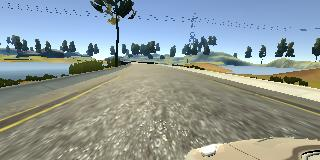
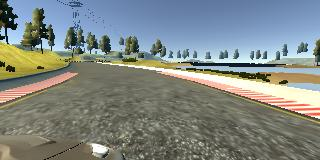

# Introduction

Driving car autonomously is a great learning oppurtunity to see how CNN can learn from images with certain parameters and predict the behavior for next move.

# Data Collection

I began as suggested by collecting data using keyboard. When I looked at distribution of data, it was concentrated on 0 angle on steering. It did not make sense to move further with such a skewed data. After reading on forums I realized it is very hard to collect good data using keyboard. I reverted to use data provided by udacity.

# Data Augumentation

Data provided by udacity was good but need augumentation. I attempted below augumentation with which model worked really well.

* Flipping Images & Sterring measurements
* Cropping
* Removed ALL zeros

Sample images from 3 different cameras:

Image from Left Camera

Image from Center Camera

Image from Right Camera

* Images were flipped using np.fliplr(image) method and added back to data set.
* It is important to confirm distribution of images with steering angle is normal as per the track before sending to train the network. I am not sure yet, model generated in 1 track can be generalized for another.

# Model Architecture and Training Strategy

My first archictecture was simple one as described in class sessions. I chose AWS to train the system. I tried Nvidia architecture to run smoother then couple of models that I trained earlier with. Final model runs great with speed of 9. Car stays in the middle most of time and able to jump back when come close to sides.  
model = Sequential()

model.add(Lambda(lambda x: x/255.0 -0.5, input_shape=(160,320,3)))
model.add(Cropping2D(cropping=((70, 25),(0,0))))
model.add(Convolution2D(24, 5, 5, subsample=(2,2),  activation="relu"))

model.add(Convolution2D(36, 5, 5, subsample=(2,2), activation="relu"))

model.add(Convolution2D(48, 5, 5,subsample=(2,2), activation="relu"))
model.add(Convolution2D(64, 3, 3, activation="relu"))
model.add(Convolution2D(64, 3, 3, activation="relu"))

model.add(Flatten())
model.add(Dense(100))
model.add(Dropout(0.5))
model.add(Dense(50))
model.add(Dropout(0.5))
model.add(Dense(10))
model.add(Dense(1))
model.compile(loss='mse', optimizer='adam')

model.fit(X_train, y_train, validation_split=0.2, shuffle=True, nb_epoch=3)

# Automation testing

When steering angle is high I modified throttle in drive.py to slow down the car. I got this suggestion in some earlier forum and found to be very helpful.

# Result
Please download the demo video run.mp4 in the project of [Autonomous Drive](run.mp4) 

# Observations

1. Project which initially looked simple went very challanging when car would either move in circles or drive into woods. After following forum ( which is of immense help) I fixed most of the issues. After all trials, car would still not drive straight. I later learnt keras was using Theano backend and not TensorFlow. Once I switched to TensorFlow, car completed the entire track with no issues in one go. Amazing experience.
2. When, I switched on recoding I found car is not behaving good. It may be due to limited hardware. Thus, for recording I have reduced speed to 7.

# Future

I would like to explore more on what happens when Throttle , Speed and Steering all need to be predicted.
