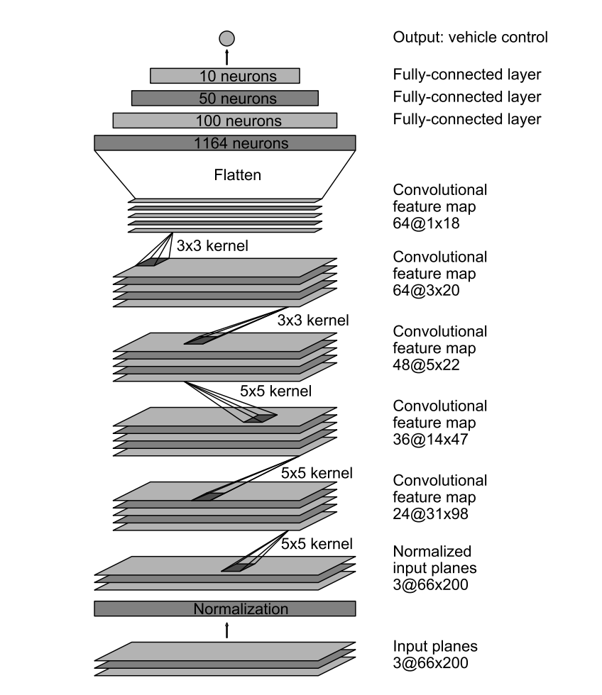

# Introduction

Driving car autonomously is a great learning oppurtunity to see how CNN can learn from images with certain parameters and predict the behavior for next move.

# Data Collection

I began as suggested by collecting data using keyboard. When I looked at distribution of data, it was concentrated on 0 angle on steering. It did not make sense to move further with such a skewed data. After reading on forums I realized it is very hard to collect good data using keyboard. I reverted to use data provided by udacity.

# Data Augumentation

Data provided by udacity was good but need augumentation. I attempted below augumentation with which model worked really well.

* Flipping Images & Sterring measurements
* Cropping
* Removed ALL zeros

Sample images from 3 different cameras:

Image from Left Camera

Image from Center Camera

Image from Right Camera

* Images were flipped using np.fliplr(image) method and added back to data set.
* It is important to confirm distribution of images with steering angle is normal as per the track before sending to train the network. I am not sure yet, model generated in 1 track can be generalized for another.

# Model Architecture and Training Strategy

My first archictecture was simple regression network as described in first class sessions. Using the model generated by the system car went straight to water in few seconds. I then tried Nvidia architecture as described in the paper.

Car started running smooth with speed and throtle adjustment in driver.py. Later, I added sizing ,cropping and dropouts in the nVidia Architecture. Adam optimizer was selected with Mean Square Error (MSE) as loss function. 20% of images were kept for validation.

# Timings
I ran numbers in AWS-GPU instance and Surface Book  and found difference factor of 10-15 times, as shown below:

** AWS Timing** 
Train on 17203 samples, validate on 4301 samples
Epoch 1/3
17203/17203 [==============================] - 40s - loss: 0.0197 - val_loss: 0.0165
Epoch 2/3
17203/17203 [==============================] - 33s - loss: 0.0161 - val_loss: 0.0169
Epoch 3/3
17203/17203 [==============================] - 33s - loss: 0.0155 - val_loss: 0.0175

** Laptop Timing **
Train on 17203 samples, validate on 4301 samples
Epoch 1/3
17203/17203 [==============================] - 555s 32ms/step - loss: 0.0197 - val_loss: 0.0180
Epoch 2/3
17203/17203 [==============================] - 636s 37ms/step - loss: 0.0162 - val_loss: 0.0168
Epoch 3/3
17203/17203 [==============================] - 299s 17ms/step - loss: 0.0157 - val_loss: 0.0168

# Automation testing

When steering angle is high I modified throttle in drive.py to slow down the car. I got this suggestion in some earlier forum and found to be very helpful.

# Result
Please download the demo video run.mp4 in the project of [Autonomous Drive](run.mp4) 

# Observations

1. Project which initially looked simple went very challanging when car would either move in circles or drive into woods. After following forum ( which is of immense help) I fixed most of the issues. After all trials, car would still not drive straight. I later learnt keras was using Theano backend and not TensorFlow. Once I switched to TensorFlow, car completed the entire track with no issues in one go. Amazing experience.
2. When, I switched on recoding I found car is not behaving good. It may be due to limited hardware. Thus, for recording I have reduced speed to 7.
3. No matter what architecture I used car would straight head out to water. Later, I found out I was using Keras and not Tensor Flow when running autonomus drive.

# Future

I would like to explore more on what happens when Throttle , Speed and Steering all need to be predicted.
